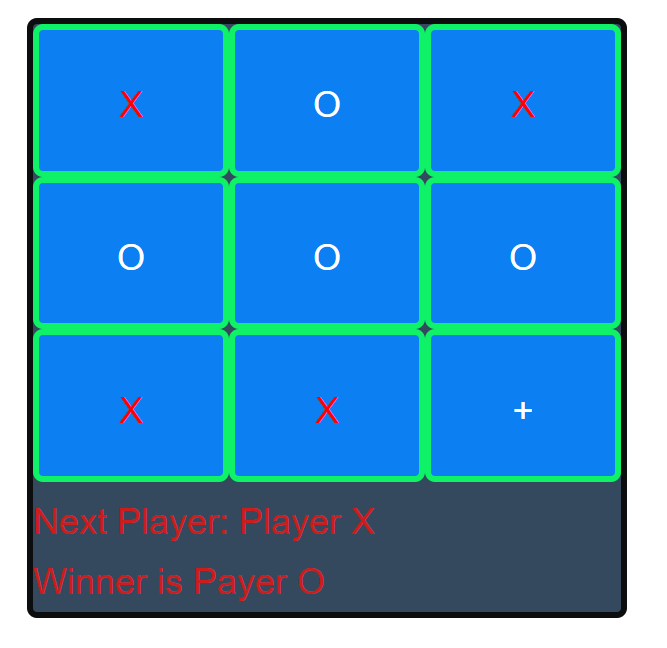

# TicTacToe

## Description 
This is a simple Tic Tac Toe game. First player to get 3 in a row (horizontally, vertically, or diagonally, wins.

## Purpose 
This was done as an assignment in the MIT course - Full Stack Development with Mern

---------

## Technologies Used 
- HTML
- CSS
- Javascript

---------

## Installation 
- Clone this repository to your local machine
- Open a command line on your computer and run the command cd path-to-project-root (this should be the actual directory where the repository is located on your local machine)
- Within the same command-line window, run npm install http-server which will allow you to fire up a web server to access the paage
- Once the command completes successfully, run http-server -c-1
- Open your browser of choice and browse to http://127.0.0.1:8080/

## How to Run 
- Take turns with another player (or with yourself) clicking on a square (Players take turns putting their marks in empty squares *Square with a +)
- The first player to get 3 of their marks in a row (up, down, across, or diagonally) is the winner.
- If all 9 squares are full, and there is no winner, the game is a draw
- Refresh the browser to play again

---------

## Files 
- **/index.html** - Start-up file to be opened by browser
- **/tictactoe.js** - Contains the React code and logic to build the tictactoe game
- **/styles.css** - Stylesheet file that positions objects, controls text, colors, and layout
- **/TicTacToe.png** - Screenshot for ReadMe

---------

## Improvements Made
- 2022-04-08: Added check to make sure when a user made a selection the square gets disabled so it can't be overwritten
- 2022-04-08: Added check for when winner is found to disable any further selectionsopacity
- 2022-04-11: Added ability to play One Player (vs Computer *Random) or Two Player (take turns)
- 2022-04-11: Added turn/winner notification text to be same as player (X -> red / O -> white)
- 2022-04-11: Stopped human player from clicking when computer's turn

## Roadmap of Future Improvements
- Add the ability to restart the game
- Add the ability to give players names

---------

## Contributing 
Pull requests are welcome. For major changes, please open an issue first to discuss what you would like to change.

## License
[The MIT License (MIT)](https://github.com/slumpbuster/Formik/blob/main/LICENSE)
